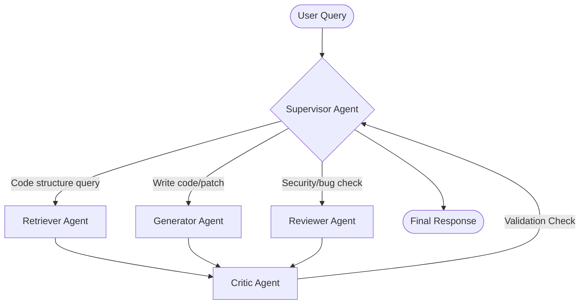

# CodeMind Portfolio Review & Assessment
**Target Role:** GenAI Engineer (3 Years Experience | 15–20 LPA Package)

This review evaluates the current state of **CodeMind**, identifies critical bugs, proposes architectural improvements, recommends technical stack adjustments, and provides guidance on how to make this project stand out to recruiters and hiring managers.

---

## 1. Executive Summary & Project Alignment
A project like **CodeMind** is an excellent choice for a GenAI portfolio. Rather than being another generic wrapper around a chat model, it demonstrates:
*   Custom parsing (AST analysis) instead of naive text splitting.
*   Structured data models using SQLAlchemy, Alembic, and Pydantic.
*   Vector databases (ChromaDB) with session partitioning.
*   Agentic system architecture (even though empty, the skeleton is present).

**For a 15–20 LPA GenAI position**, recruiters are looking for **production readiness**, **cost control**, **observability**, **system design (async architecture)**, and **evaluation metrics**. Your current implementation has built a solid foundation for Phase 1 & 2, but there are multiple critical bugs and structural design choices that need to be resolved.

---

## 2. Codebase Breakdown & Implementation Status

| Component | Implemented | Status & Quality |
| :--- | :---: | :--- |
| **API Layer** | Yes | FastAPI router skeleton, missing `/status` implementation. |
| **Database** | Yes | SQLAlchemy & Alembic setup. Correct use of async sessions. |
| **Parser** | Yes | Python AST parser extracts classes and functions cleanly. |
| **Chunking** | Yes | CodeChunker separates code into main chunks and summary chunks. |
| **Vector DB** | Yes | ChromaDB partition per session (`session_id`). |
| **RAG Retrieval** | Yes | Similarity search based on sentence-transformers. |
| **LLM Inference** | Yes | Groq API integration for cheap, fast inference. |
| **Agents (LangGraph)**| No | `app/agents/` folder contains empty placeholder files. |
| **Background Tasks** | No | Ingestion runs synchronously in FastAPI thread pool. |
| **Observability / Eval**| No | No tracking of latency, costs, or hallucination metrics. |

---

## 3. Critical Bugs & Immediate Fixes

During the code review, I identified the following bugs that will crash the application or lead to unexpected behavior:

### Bug A: Missing Argument in `retrieve_with_scores`
*   **File:** [app/rag/retriever.py](file:///home/incipient/python/genai/codemind/app/rag/retriever.py#L42-L55)
*   **Problem:** At line 44, `self._get_vectorstore()` is called with no arguments. However, the definition of `_get_vectorstore` at line 20 requires `session_id`.
*   **Effect:** Any call to `retrieve_with_scores` will raise:
    `TypeError: _get_vectorstore() missing 1 required positional argument: 'session_id'`
*   **Fix:**
    ```python
    # Change:
    vectorstore = self._get_vectorstore()
    # To:
    vectorstore = self._get_vectorstore(session_id)
    ```

### Bug B: Overwriting Chunk IDs in Incremental Ingestion
*   **File:** [app/vectorstore/chroma.py](file:///home/incipient/python/genai/codemind/app/vectorstore/chroma.py#L23-L37)
*   **Problem:** In `add_documents`, chunk IDs are generated as:
    `ids = [f"chunk_{i}_{session_id}" for i in range(len(documents))]`
*   **Effect:** If a user runs ingestion twice on the same session, or updates a repo, the indices will start from `0` again. The new chunks will silently overwrite the old chunks because Chroma keys by ID.
*   **Fix:** Generate deterministic IDs based on a hash of the content (e.g., md5 of `page_content + file_path`) or use UUIDs:
    ```python
    import uuid
    ids = [f"chunk_{uuid.uuid4()}" for _ in range(len(documents))]
    ```

### Bug C: Invalid Query Metadata Filter
*   **File:** [app/rag/retriever.py](file:///home/incipient/python/genai/codemind/app/rag/retriever.py#L42-L55)
*   **Problem:** At line 48, the similarity search uses a metadata filter: `filter={"session_id": session_id}`.
*   **Effect:** No documents will ever be retrieved. Why? Because you partition the vector store by dynamic collection names (`session_{session_id}`), and the metadata inside the chunk ([app/rag/chunker.py](file:///home/incipient/python/genai/codemind/app/rag/chunker.py#L29-L40)) **does not contain** the key `"session_id"`.
*   **Fix:** Since you've already isolated the session using the collection name in `self._get_vectorstore(session_id)`, you do not need the metadata filter:
    ```python
    docs_with_score = vectorstore.similarity_search_with_score(
        query=query,
        k=k
    )
    ```

### Bug D: Deprecated Python Datetime Call
*   **File:** [app/services/ingestion_service.py](file:///home/incipient/python/genai/codemind/app/services/ingestion_service.py#L49)
*   **Problem:** `datetime.utcnow()` is used. This method is deprecated in Python 3.12+ and can cause timezone-naive comparison bugs.
*   **Fix:** Use timezone-aware UTC datetime:
    ```python
    from datetime import datetime, timezone
    ingested_at=datetime.now(timezone.utc)
    ```

---

## 4. Key Architectural & Production Bottlenecks

### 1. Blocking Git Operations in FastAPI Event Loop
In `app/services/ingestion_service.py` ([line 73](file:///home/incipient/python/genai/codemind/app/services/ingestion_service.py#L73)), you call `Repo.clone_from(request.repo_url, clone_path)`.
*   **Why it's bad:** Git cloning is an I/O-bound synchronous operation that can take up to several minutes. Doing this in an `async def` function blocks the single-threaded FastAPI event loop. While cloning, **your entire server is frozen** and will not respond to any other user requests.
*   **Solution for 15-20 LPA:** Offload this to a task queue. Celery + Redis is the enterprise standard, but for a simplified Python stack, you could use **FastAPI's built-in `BackgroundTasks`** or **RQ (Redis Queue)**. Offloading this task allows you to return a `202 Accepted` immediately and implement a working `/status/{session_id}` endpoint.

### 2. Client Re-Instantiation Overhead
*   **Chroma PersistentClient:** In `ChromaVectorStore` and `CodeRetriever`, you instantiate a new connection client on every class initialization. In a high-traffic app, creating hundreds of file-system connection locks will degrade performance.
*   **Groq / Embeddings Client:** You instantiate the HuggingFace embeddings client and Groq client inside service class `__init__` calls. Embedding models load weights (in case of local runners) or instantiate network clients on each request.
*   **Solution:** Initialize database clients, vector store clients, and LLM clients at application startup using FastAPI Lifespan events, and inject them using FastAPI dependencies (`Depends`).

### 3. File System Resource Leak
During repository cloning, repositories are cloned to `data/{session_id}`.
*   **Issue:** There is no cleanup logic. If the ingestion fails or completes, the source code remains on disk. Over time, cloning repositories will consume disk space and crash the server.
*   **Solution:** Implement a cleanup service or background cron job that deletes the cloned code directories once ingestion/indexing is complete.

---

## 5. Technology Recommendations (What to Add/Remove)

### Tech to Keep / Focus On:
*   **Groq & Sentence-Transformers:** Fast, cheap, and works beautifully. Good selection.
*   **FastAPI & SQLAlchemy Async:** Excellent showcase of modern asynchronous Python.
*   **Alembic:** Essential. It proves you understand schema migrations and DB lifecycle.

### Tech to Add:
1.  **Celery + Redis:** Indispensable for running ingestion asynchronously. It also allows you to handle rate limits and retries easily.
2.  **Reranking (e.g., Cohere or BGE-Reranker):** Standard similarity search often misses code context because keyword relevance is low. Adding a reranking step after initial vector retrieval boosts accuracy by 20–30%.
3.  **Observability / Tracing (LangSmith / OpenLLMetry / Phoenix):** Implementing this will instantly set you apart. It shows you know how to debug complex agent workflows, monitor token usage, and track LLM latency.
4.  **Security Sandbox (Docker/E2B):** If you plan to execute code (Phase 3 Generator/Reviewer agent), you *must* isolate the environment. Executing untrusted code directly on the host server will get you flagged in security interviews. Recommend using the E2B sandbox SDK or a dynamic Docker daemon.

### Tech to Remove / Re-Evaluate:
*   **Direct HuggingFaceEmbeddings local execution:** Sentence-transformers runs PyTorch locally. If you deploy this to a free tier like Render or Hugging Face Spaces, the CPU/Memory usage will crash the container.
    *   *Alternative:* Use an external embedding API (like OpenAI, Cohere, or Groq/Mixbread if available) or use a lightweight ONNX runtime wrapper for Sentence-Transformers to keep memory footprint under 500MB.

---

## 6. Elevating to a 15–20 LPA Level

To stand out in the current GenAI market, you need to transition your project from a "basic chatbot" to an **"intelligent, production-grade system."** Focus on the following areas:

### A. Implementing advanced parsing & Code Graph (The RAG Differentiation)
Simple textual chunking is weak for code because code is hierarchical and relational.
*   **AST Dependency Mapping:** Write a dependency parser (`dependency_parser.py`) that extracts imports and mappings between files. Store this dependency graph in a graph library (like `networkx`) or a database.
*   **Graph-Relational Retrieval:** When a user asks about `ClassA`, retrieve not only the chunk of `ClassA` but also its parent class, its subclass, and files importing `ClassA`. This makes your RAG system incredibly smart.

### B. Building the LangGraph Multi-Agent Architecture
The empty `app/agents/` folder is where you need to implement your agent system.
Instead of a simple chain, implement a **Supervisor-Worker** layout:

*   **Retriever Agent:** Looks up files in the vector store and queries the dependency graph.
*   **Reviewer Agent (Critic):** Evaluates generated code for security and syntactical bugs.
*   **Generator Agent:** Produces git patches using code syntax constraints.

### C. Evaluation & Quality Assurance
GenAI roles place huge importance on evaluation. Implement a small script or test suite that evaluates:
*   **Faithfulness (Hallucination rate):** Does the answer contain facts not present in the retrieved source files?
*   **Answer Relevance:** Does the answer address the user's specific coding problem?
*   **Code Executability:** If code is generated, run it through `pylint` or `black` in your test suite to verify format correctness.

---

## 7. Action Plan (Next Steps)

1.  **Fix the bugs (Chroma IDs, Retriever arguments, metadata filter).**
2.  **Add Background Tasks:** Implement FastAPI `BackgroundTasks` for cloning and parsing so your endpoints are non-blocking.
3.  **Build the LangGraph agents:** Start with the Supervisor router and a Retrieval agent.
4.  **Write the README.md:** Make a gorgeous, detailed overview of the system architecture, DB schema, RAG pipeline, and LangGraph agent workflow. Include code snippets showing how you solved AST parsing and asynchronous ingestion.
5.  **Deploy and Demo:** Prepare a 3-minute Loom video walking through a codebase query and code refactoring patch generation.
